# 대구시 교통사고 데이터를 활용한 피해 분석 및 예측 모델 개발

## 📌 프로젝트 개요
**DACON**에서 진행한 **대구 교통사고 피해 예측 AI 경진대회**에 참가해 교통사고 데이터를 활용한 **사고 위험도(ECLO) 예측 모델**을 개발하는 프로젝트를 진행했습니다. 데이터 분석을 통해 현황 및 EDA 분석을 통한 주요 사고 위험 요인 인사이트를 탐색하고 탐색된 인사이트를 활용해 인공신경망(ANN) 기반 ECLO 점수를 예측하는 모델을 구축했습니다.

 본 프로젝트는 멀티캠퍼스 **데이터분석&엔지니어 교육 과정**에서 세미프로젝트로 처음 진행했으나, 당시 결과물이 만족스럽지 않아 교육 수료 이후 **개인 프로젝트로 전반적인 내용을 새롭게 재구성**하였습니다. 

--------------------------------

### 🎯 프로젝트 목표
- DACON 제공 교통사고 데이터 및 외부데이터를 활용해 **사고 위험도(ECLO) 예측 모델 개발**
- **ECLO (Equivalent Casualty Loss Only)란 ?** : 인명피해 심각도를 나타내는 지표
    - **ECLO = 사망자수×10 + 중상자수×5 + 경상자수×3 + 부상자수×1**
- 모델 성능 평가 기준 : **RMSLE** 
- 통계 및 시각화 분석을 통한 주요 사고 위험 요인 탐색 후 탐색된 인사이트 활용 피처 엔지니어링 및 모델 엔지니어링을 통해 **주요 사고 위험 요인을 규명하고 최적 예측 모델을 구축**

--------------------------------

### 📅 프로젝트 수행 기간
- **데이터분석&엔지니어 교육 과정 세미프로젝트** 
  - 팀 구성 : 4명
  - 기간 : 2023.11.14 ~ 2023.12.04  

- **개인 프로젝트로 리빌딩**
  - 팀 구성 : 1명
  - 기간 : 2025.05.01 ~ 2025.07.24

--------------------------------

### 🔄 프로젝트 수행 방식
1. 데이터 수집 및 기본 전처리 → 2. 데이터 셔플링 여부 결정 및 기본 분석 모델 선정 → 3. Layer·LR 최적화 실험 → 4. 최적 인코딩 방법 선정 → 5. 최적 종속변수 변환 방법 및 손실함수 선정 → 6. EDA → 7. 피처 엔지니어링 → 8. 모델 엔지니어링 → 9. 최종 모델 제출

--------------------------------

### 📊 수집 데이터 구성
| 구분 | 데이터 | 기간 | 규모 | 출처 |
|------|---------|------|------|------|
| **DACON 제공 데이터** | Train 데이터 (대구시 교통사고) | 2019~2021 | 약 4만 건 | DACON |
|  | Test 데이터 (대구시 교통사고) | 2022 | 약 1.1만 건 | DACON |
|  | 전국 교통사고 데이터 | 2019~2021 | 약 11만 건 | DACON |
| **외부 데이터** | 대구시 보안등 설치 위치 | - | - | D-데이터허브 |
|  | 대구시 CCTV 설치 위치 | - | - | D-데이터허브 |
|  | 대구시 연령별 인구 현황 | 2019~2021 | - | 대구통계 |
|  | 대구시 강수량 데이터 | 2019~2021 | - | 기상청 |
|  | 연도별 공휴일 정보 | - | - | 공공데이터포털 |

- 훈련 데이터 피처 구성 목록     
: `사고일시`, `시 군 구`, `기상상태`, `노면상태`, `도로형태`, `사고유형`, `사고유형-세부분류`, `법규위반`, `가해운전자 차종`, `가해운전자 성별`, `가해운전자 연령`, `가해운전자 상해정도`, `피해운전자 차종`, `피해운전자 성별`, `피해운전자 연령`, `피해운전자 상해정도`, `사망자수`, `중상자수`, `경상자수`, `부상자수`, `ECLO`

- 테스트 데이터 피처 구성 목록     
: `사고일시`, `시 군 구`, `기상상태`, `노면상태`, `도로형태`, `사고유형`

-----------------

### 🔮 모델 학습 및 예측 프로세스
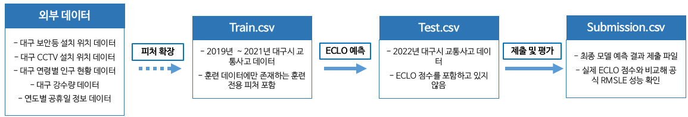

------------------------

## ⚙️ 개발 환경
| 구분 | 기술 스택 |
|------|-----------|
|**언어·라이브러리** | Python, Pandas, NumPy, Scikit-learn, SciPy, Matplotlib, Seaborn |
|**딥러닝 프레임워크** | TensorFlow, Keras |
|**하이퍼파라미터 최적화** | Optuna |
|**개발 도구 및 환경** | Jupyter Notebook, Google Colab, Google Drive |

------------------------

## 🔧 데이터 기본 전처리
원천 데이터 구조를 정리하고 분석 가능한 형태로 가공하기 위해 `정규표현식`을 사용해 다음과 같은 전처리를 수행했습니다.

- **사고일시 파싱** : `사고일시` → `연/월/일/시간` 단위로 분리

- **행정구역 분리** : `시군구` → `도시 / 구 / 동` 단위로 분리

- **도로형태 분리** : `단일로 - 기타`처럼 복합적으로 표기된 값을 분리해 `도로형태1`, `도로형태2`와 같은 파생변수 생성

[기본 전처리 코드 바로가기](./feature_basic_preprocessing.ipynb)

보안등 설치 소재지지번 주소를 활용해 Selenium 기반 위도, 경도 크롤링을 통해 보안등이 설치된 위치의 `구`, `동`을 특정지었습니다.

[보안등 설치위치 위도, 경도 크롤링 코드 바로가기](./selenium_security_light_geolocation_extraction.ipynb)

### 피처 특성 분류    
훈련 데이터와 테스트 데이터의 피처 목록이 동일하지 않기 때문에 훈련 데이터 기준으로 변수를 **시간적 요인**·**공간적 요인**·**환경적 요인**·**훈련 전용 피처**로 특성을 분류했습니다.

1. 시간적 요인 : `연`, `월`, `일`, `시간`
2. 공간적 요인 : `구`, `동`
3. 훈련 전용 피처 : `가해운전자 차종/성별/연령`, `피해운전자 차종/성별/연령`, `법규위반`    
   (ECLO 점수 형성에 직접적인 영향을 주는 `사망자수`, `중상자수`, `운전자 상해정도`와 같은 피처는 분석에서 제외)

--------------------------------

## 🎴 데이터 셔플링 여부 결정 및 기본 분석 모델 선정
**XGBoost**, **LightGBM**, **ANN** 모델의 기본 구조를 활용해 데이터가 시계열적 특성을 갖고 있는지 확인하기 위해 데이터 분리 시, 각 모델별 `shuffle=False/True` 옵션을 적용해 단일 성능 측정을 비교했습니다.

단일 `RMSLE` 지표에 국한되지 않고 모델의 종합적 성능 비교를 위해 `MSE`, `RMSE`, `RMSLE`, `R²`를 함께 측정했습니다. 또한, 모델 간 공평한 성능 평가를 위해 각 지표를 정규화한 뒤 가중치를 적용한 `scoring_model` 함수를 설계했으며, 이때 가중치는 각각 `{'MSE': 0.2, 'RMSE': 0.2, 'RMSLE': 0.5, 'R2': 0.1}` 로 설정했습니다.

- **모델 성능 점수 계산 함수**
  ```
  def scoring_model(results):
    # 가중치 설정
    weights = {'MSE': 0.2, 'RMSE': 0.2, 'RMSLE': 0.5, 'R2': 0.1}

    # 정규화 함수
    # 평가지표 별 값의 범위를 통일하기 위해 Min-Max 스케일링 수행
    def min_max_normalize(series, is_better_lower=True):
      min_val = series.min()
      max_val = series.max()
      normalized = (series - min_val) / (max_val - min_val)

      # R2는 높을수록, MSE, RMSE, RMSLE는 낮을수록 성능이 좋은 특성을 반영
      if is_better_lower:
        return 1 - normalized
      else:
        return normalized

    # 정규화 적용
    df_normalized = results.copy()
    df_normalized['MSE'] = min_max_normalize(results['MSE'], is_better_lower=True)
    df_normalized['RMSE'] = min_max_normalize(results['RMSE'], is_better_lower=True)
    df_normalized['RMSLE'] = min_max_normalize(results['RMSLE'], is_better_lower=True)
    df_normalized['R2'] = min_max_normalize(results['R2'], is_better_lower=False)

    # 성능 종합 점수 계산
    # 평가지표별 Min-Max 스케일링 값 * 가중치
    df_normalized['Score'] = (df_normalized['MSE'] * weights['MSE'] +
                              df_normalized['RMSE'] * weights['RMSE'] +
                              df_normalized['RMSLE'] * weights['RMSLE'] +
                              df_normalized['R2'] * weights['R2'])


    results['Score'] = df_normalized['Score']

    # 점수에 따라 모델 정렬 (내림차순)
    results = results.sort_values(by='Score', ascending=False).reset_index(drop=True)

    return results  
  ```

- **셔플링 여부에 따른 모델별 성능 점수(Score) 측정 결과**
  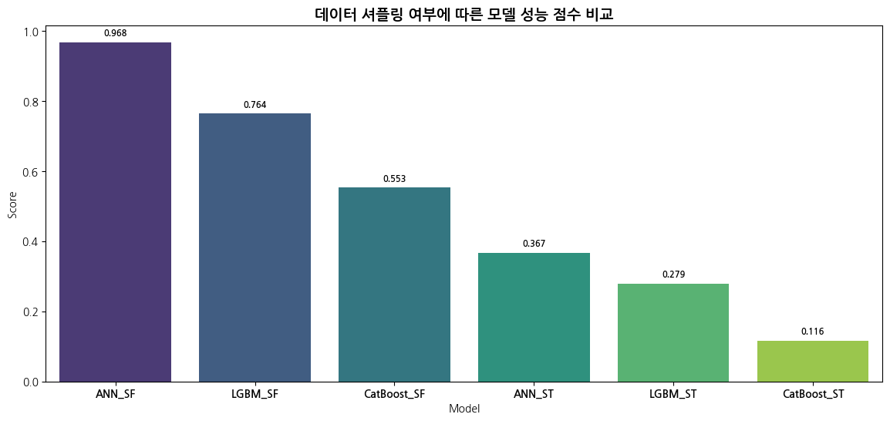

**💡 주요 인사이트**
- 셔플링을 적용하지 않은 모든 모델이 적용한 모델보다 높은 성능을 보임
- 그 중 **인공신경망(ANN)** 모델이 가장 높은 성능을 보임. 따라서 ANN을 기본 분석 모델로 선정
- 데이터가 시계열적 특성을 지님을 확인

[기본 분석 모델 설정 코드 바로가기](./1.%20데이터%20셔플링%20여부가%20모델%20성능에%20미치는%20영향%20분석/1.%20데이터%20셔플링%20여부가%20모델%20성능에%20미치는%20영향%20분석.ipynb)

--------------------------------

## 🔎 ANN Layer·LR 최적화
파생변수 추가 및 피처 변환에 따른 성능 변화를 정확히 검증하기 위해, Optuna 기반 최적 `학습률(LR)`과 `층(Layer)` 구성을 탐색하여 모델의 기본 구조를 확립했습니다.

- **최적화 수행 방식**
  - Optuna 활용 Layer, LR에 대한 하이퍼파라미터 탐색을 통한 최적화 수행
  - 탐색 목표 : RMSLE 최소화 (`direction='minimize'`)
  - 탐색 횟수 : 50회 (`n_trials=50`)

- **탐색 공간(Search Space) 설정**
  | Hyperparameter   | Type         | Range / Candidates     | 설명 |
  |------------------|--------------|------------------------|------|
  | `n_layers`       | Integer      | 3 – 7                 | 은닉층 개수 |
  | `initial_units`  | Categorical  | unit_val 리스트 내 선택 | 첫 층 유닛 수 (예: 128, 256, 512 등) |
  | `min_units`      | Categorical  | {16, 32}              | 마지막 층 최소 유닛 수 |
  | `learning_rate`  | LogUniform   | 1e-5 – 1e-2           | Adam 학습률 |
  - Epoch: 200 / EarlyStopping: `patience = 20`, `restore_best_weights=True`
  - 데이터 분할: Train(2019-2020), Val(Train의 20%), Test(2021)
  - 탐색 후 상위 성능 모델을 기준으로 반복 학습(5회)을 수행하고, 각 평가지표별 성능 평균을 통한 일반화 성능 점수를 계산해 평가해 최적 학습률(LR), 층(Layer) 구성 선정

**💡 주요 인사이트**   
- 최적 탐색 결과 `64–32` 구조와 학습률 `0.001`이 채택되었으나, 기본 모델과 성능 차이는 크지 않았음
- 단순히 모델을 복잡하게 하기보다 **손실 함수·활성화 함수 등 다른 하이퍼파라미터 탐색**이 필요함

[ANN Layer 및 LR 최적화 코드 바로가기](./2.%20ANN모델%20기본%20Layer_LR%20최적화%20분석/ANN_Layer_LR%20최적화.ipynb)

--------------------------------

## 🔡 최적 인코딩 방법 선정
범주형 변수에 대한 적합한 인코딩 방법을 찾기 위해, `Target`, `One-Hot`, `Label`, `Embedding` 인코딩 방법에 따른 반복 성능 10회 측정을 통한 일반화 성능을 비교해 최적 인코딩 방법을 선정했습니다.

실험 결과, **원-핫 인코딩** 방식이 가장 우수한 성능을 나타냈으며, 이에 따라 **모델 기본 인코딩 방식을 원-핫 인코딩 방식으로 채택**했습니다.

- **인코딩 방식별 성능 점수 비교**
  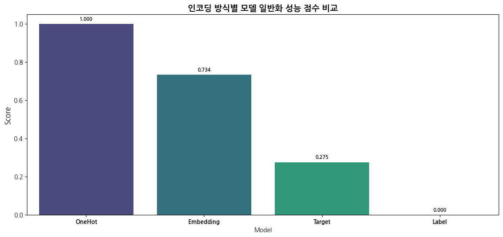

[최적 인코딩 방법 선정 코드 바로가기](./3.%20인코딩%20방법%20선정/최적%20인코딩%20방법%20선정.ipynb)

--------------------------------

## 🔄 최적 종속변수 변환 방법 및 손실함수 선정
ECLO 종속변수의 분포를 분석한 결과, **오른쪽으로 긴 꼬리를 가진 비대칭 분포(Positive Skewness)** 임을 확인하였습니다. 이에 따라 `로그`, `제곱근`, `박스-콕스(Box-Cox)`, `로그-제곱근` 변환을 적용하고, 각 변환 방식별 일반화 성능을 비교했습니다.

또한, 각 변환 방법별로 `MAE`, `RMSE`, `MSE`, `Huber` 손실함수를 적용한 **일반화 성능**(반복 성능 측정 10회)을 측정하였으며, 이를 통해 **최적 종속변수 변환 방법과 손실함수 조합**을 선정했습니다.

공식 평가 지표인 RMSLE는 학습 과정에서 **NaN값**이 과도하게 발생해 안정적인 학습이 어려웠기 때문에 손실 함수 실험 목록에서 제외했습니다.

- **종속변수(ECLO) 데이터 분포**
  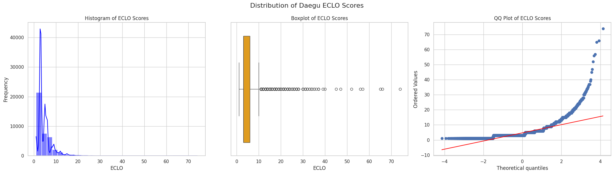

  최대값(74)이 매우 크고 이상치가 다수 존재하는 **Positive Skewness** 분포 형태를 확인

- **종속변수 변환 방법별 왜도(Skewness)·첨도(Kurtosis) 비교**
  | Transformation       | Daegu_Skewness | Daegu_Kurtosis |
  |-----------------------|----------------|----------------|
  | Original              | 3.351966       | 27.729966      |
  | Log Transform         | 0.462225       | 0.971508       |
  | SquareRoot Transform  | 1.282783       | 3.802206       |
  | BoxCox Transform      | 0.004734       | 0.993985       |
  | Log-Sqrt Transform    | 0.366727       | 1.057635       |
  | Z-Score Transform     | 3.351966       | 27.729966      |

- **변환 방법에 따른 손실함수 별 성능 측정 결과**
  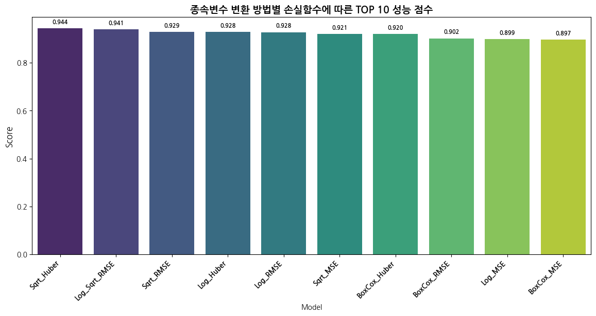

실험 결과, 종속변수인 ECLO에 **제곱근 변환**을 적용하고 `Huber Loss(delta=1.0)`를 사용한 모델이 가장 우수한 일반화 성능을 보였습니다. 이에 따라 이후 분석 및 모델 성능 측정 과정에서 ECLO에 제곱근 변환을 반영하여 **이상치 영향을 완화한 상태**로 분석을 진행했으며, 최종적으로 모델의 기본 손실함수로 `Huber Loss(delta=1.0)`를 채택했습니다.

[최적 종속변수 변환 방법 및 손실함수 선정 코드 바로가기](./5.%20종속변수%20변환%20방법에%20따른%20성능%20변화%20분석/종속변수%20변환%20방법에%20따른%20성능%20분석.ipynb)

----------------------------------------------

## 🔎 탐색적 데이터 분석(EDA)
대구 교통사고 데이터와 외부 데이터를 **시간적 요인(연·월·일·시간·요일)**, **공간적 요인(구·동, CCTV 설치, 보안등 등)**, **환경적 요인(기상 상태, 도로 형태, 노면 상태 등)**, 그리고 **훈련 전용 피처(운전자 연령·성별·차종, 법규 위반 등)** 로 구분했습니다. 이후 각 요인별로 **통계적 검정**과 **시각화 분석**을 수행하여 **주요 사고 위험 요인**을 규명하고, ECLO에 유의미한 영향을 미치는 피처를 도출함과 동시에 **파생변수 생성 가능성**을 검토했습니다.

### ⏰ 시간적 요인
  
<div align="center">

<table>
  <tr>
    <td align="center" width="50%">
      연도별 ECLO 평균 및 사고 건수 변화<br>
      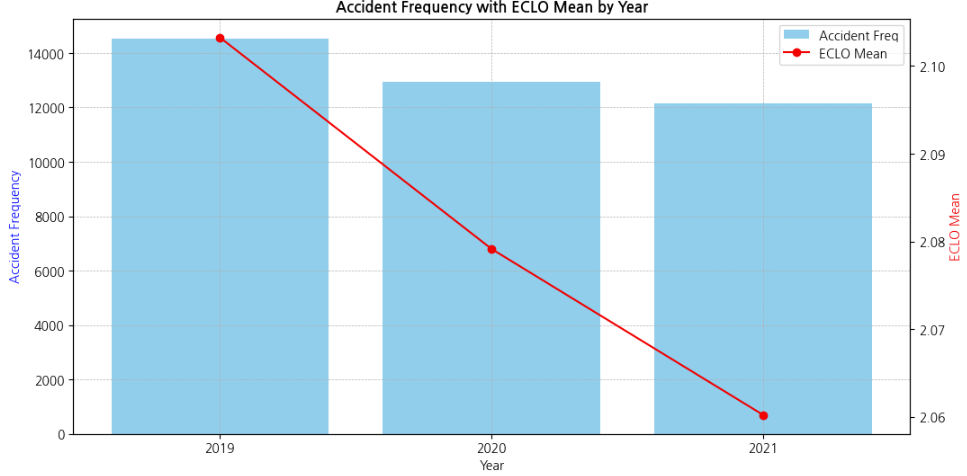
    </td>
    <td align="center" width="50%">
      2019~2021 월별 ECLO 평균 변화<br>
      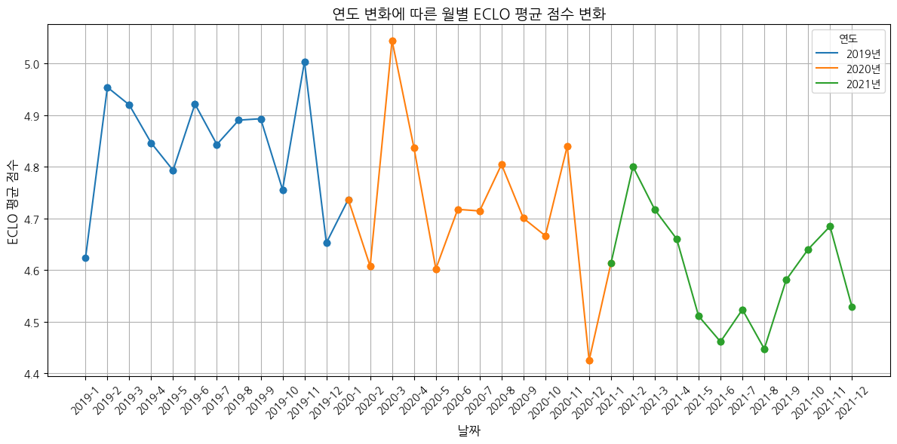
    </td>
  </tr>
    
  <tr>
    <td align="center" width="50%">
      일별 ECLO 평균 변화<br>
      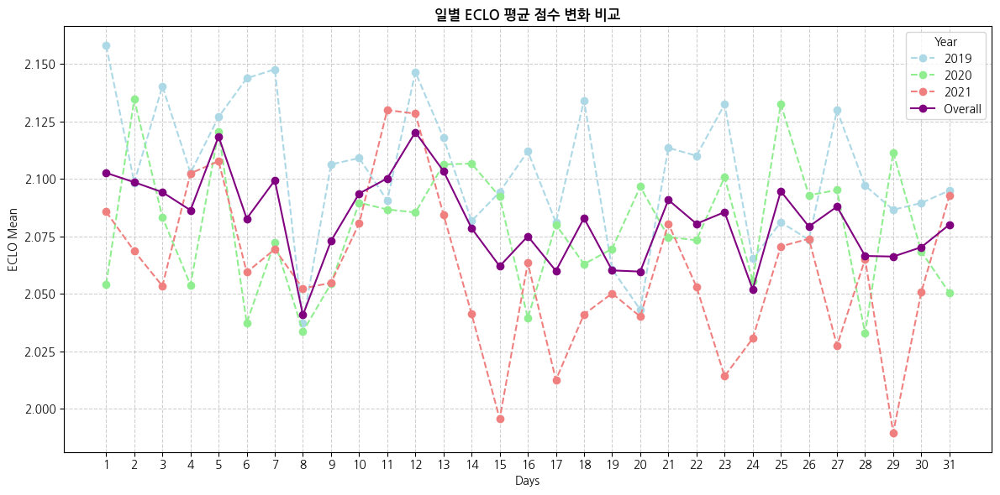
    </td>
    <td align="center" width="50%">
      시간별 ECLO 변화<br>
      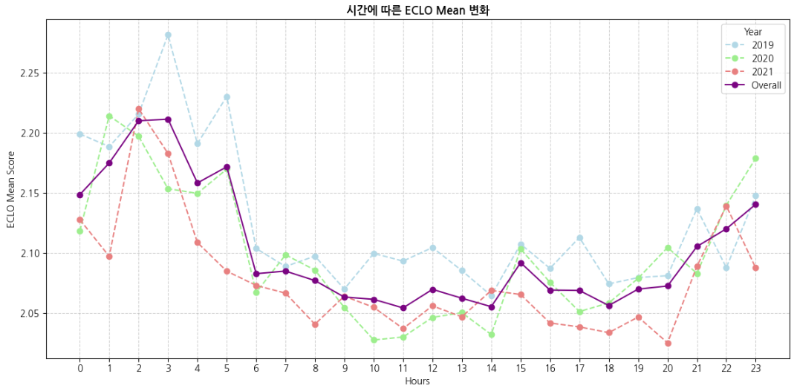
    </td>
  </tr>

  <tr>
    <td align="center" width="50%">
      요일별 ECLO 및 사고 건수 변화<br>
      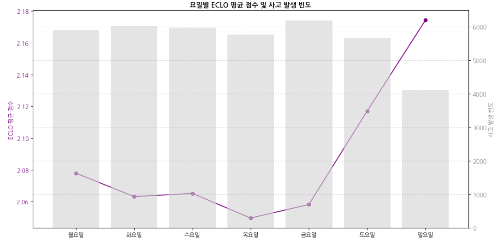
    </td>
    <td align="center" width="50%">
      주중/주말에 따른 ECLO 변화<br>
      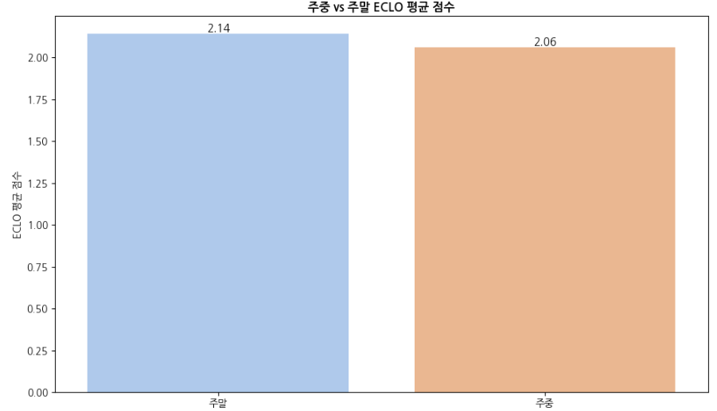
    </td>
  </tr>

  <tr>
    <td align="center" width="50%">
      공휴일에 따른 ECLO 변화<br>
      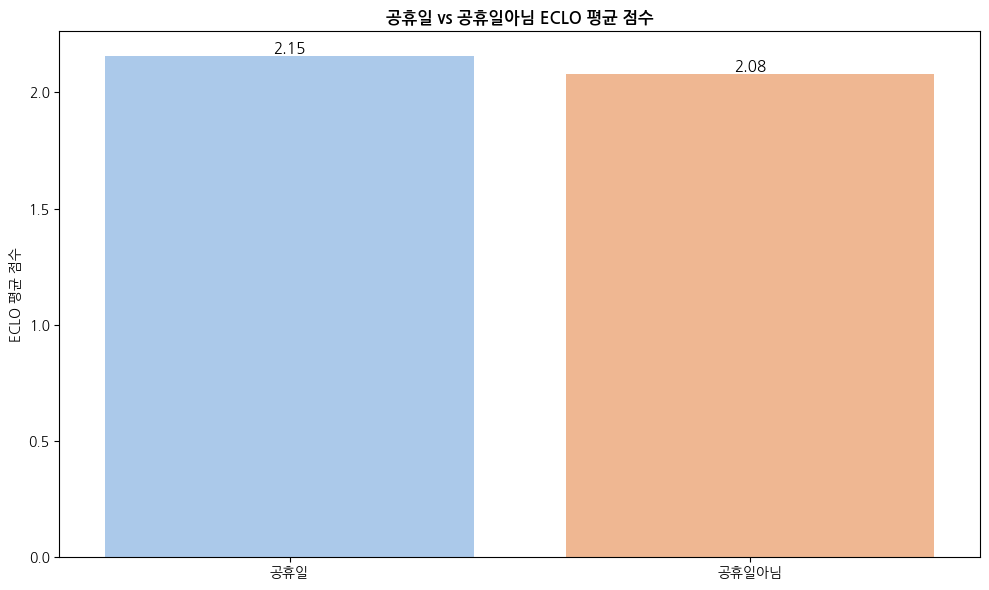
    </td>
    <td align="center" width="50%">
      주말 내 공휴일 여부에 따른 ECLO 변화<br>
      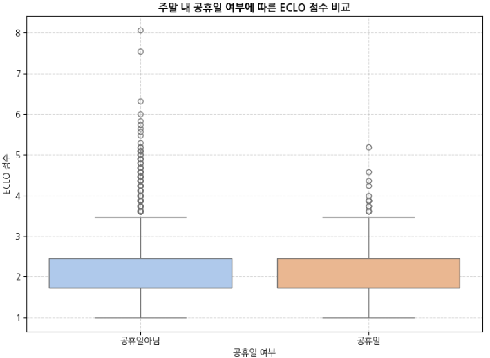
    </td>
  </tr>

</table>

</div>

- **주요 인사이트**
  - **연도별 추세**: 사고 건수와 ECLO는 전반적으로 감소하는 경향을 보이며, 이는 교통 환경 개선의 효과로 해석할 수 있다.

  - **시간대별 패턴**: 저녁(21시)부터 새벽 시간대(05시)에 ECLO가 높게 나타나며, 이는 졸음·음주 운전 등으로 인한 고위험 사고가 집중됨을 시사함. 따라서 해당 패턴을 반영하기 위해 **시간대 구분 파생변수**의 생성이 유용할 것으로 판단된다.

  - **요일·공휴일 영향**: 주말 및 공휴일에 고위험 사고가 상대적으로 많이 발생하나, 주말 내 공휴일 여부는 유의한 차이를 보이지 않음. 따라서 **주말/공휴일 구분 파생변수 생성**이 **요일 특성 반영**에 도움이 될 것으로 기대된다.

[시간적 요인 EDA 코드 바로가기](./6.%20현황분석/1.%20시간적%20정보에%20대한%20데이터%20현황%20분석.ipynb)

----------------------------------------------

### 🗺️ 공간적 요인
<div align="center">

<table>
  <tr>
    <td align="center" width="50%">
      구별 공간 기반 ECLO 분포<br>
      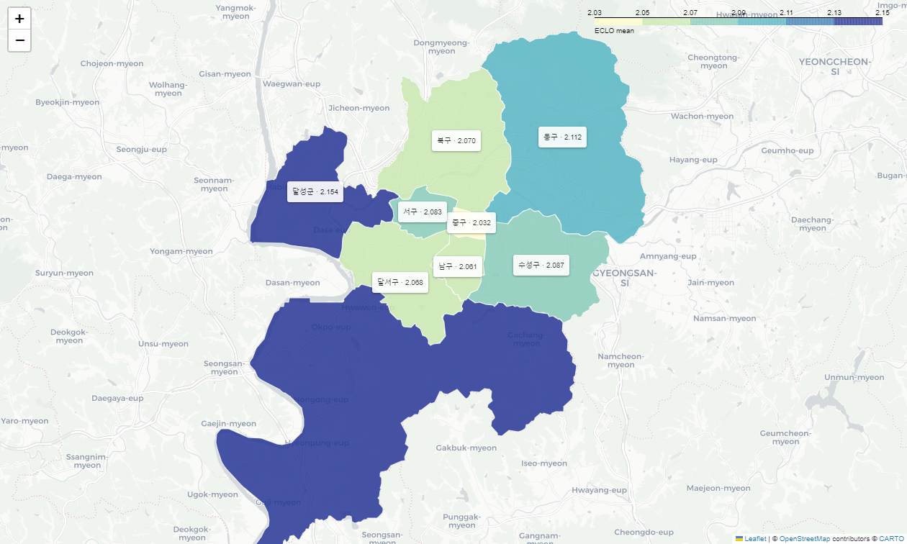
    </td>
    <td align="center" width="50%">
      구별 면적, ECLO 평균, 사고 건수 추세 비교<br>
      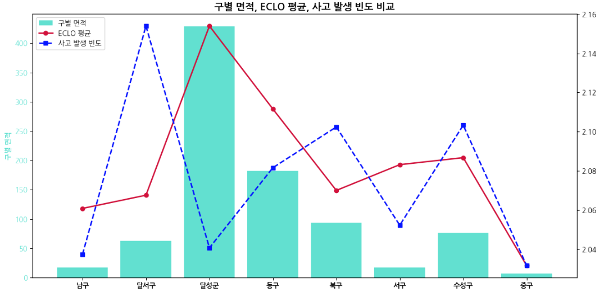
    </td>
  </tr>
  <tr>
    <td align="center" width="50%">
      구별 면적대비 보안등 설치 밀도와 ECLO 평균 비교<br>
      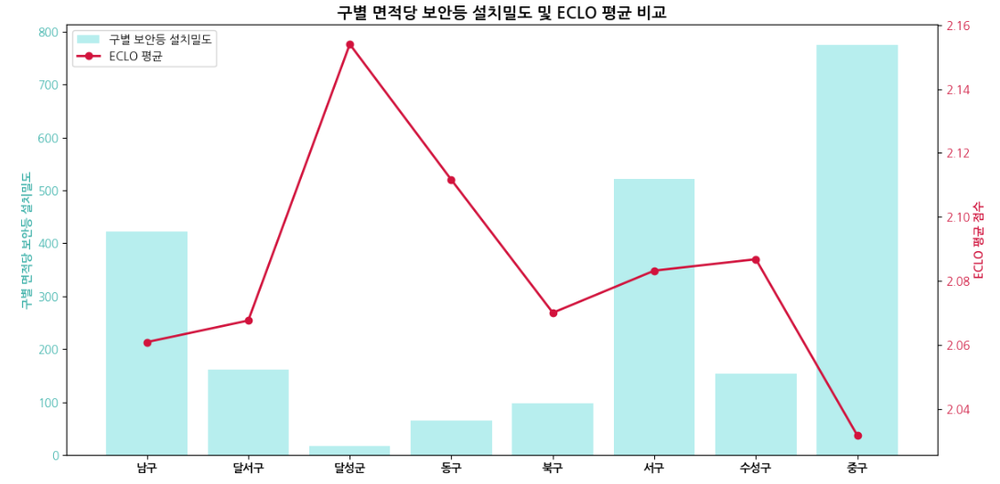
    </td>
    <td align="center" width="50%">
      구별 면적대비 CCTV 설치 밀도와 ECLO 평균 비교<br>
      
    </td>
  </tr>
</table>

</div>

- **주요 인사이트**
  - **외곽·대면적 지역(달성구, 동구 등)** 은 고속도로·터널 분포, 고속 주행 빈도, 응급 대응 지연 등으로 인해 평균 ECLO가 높게 나타남.

  - **도심·주거 혼합 지역(달서구, 수성구 등)** 은 사고 건수는 많지만 고속 주행 빈도가 낮아 평균 ECLO는 상대적으로 낮음.

  - 보안등·CCTV 설치 밀도가 낮은 지역일수록 평균 ECLO가 높게 나타나며, 통계적으로도 유의미한 영향 요인으로 확인됨.

  - 따라서 구별 면적, 교통 인프라, 안전 시설 밀도가 ECLO 형성에 중요한 영향을 미치며, 이를 반영한 파생변수 추가가 분석력 향상에 기여할 수 있음.

#### 다변량 군집분석을 통한 동 위험도 구분
상대적으로 범주 수가 많은 동 데이터에 대해 `K-Means 클러스터링 기법`을 활용한 동별 ECLO 통계량 기반 **다변량 군집분석**을 수행해 동별 위험도 구분에 따른 ECLO에 미치는 영향을 분석했습니다. 

- 동별 ECLO 통계량 기반 Elbow Method 활용 최적 군집 수 K값 탐색 
  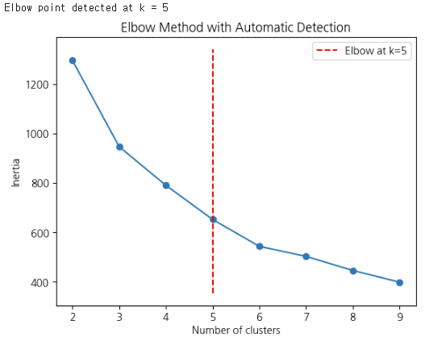

- 최적 K값으로 K-Means 클러스터링 수행 후, PCA 시각화를 통한 군집별 특성 분석
  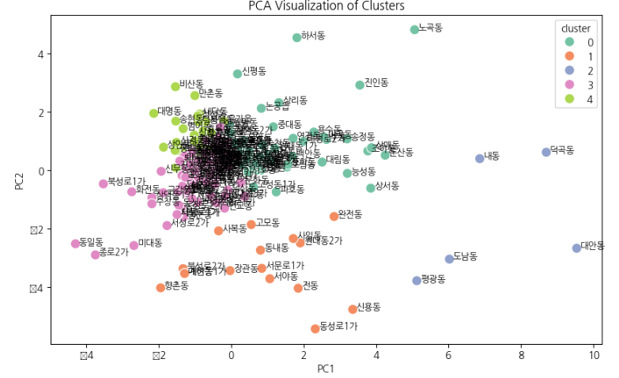

- 다변량 군집분석을 통해 구분된 동별 군집에 대한 ANOVA 검정 결과, 군집 간 ECLO 점수는 통계적으로 매우 유의한 차이를 보임
- 따라서 동이 ECLO에 미치는 영향을 부각시키기 위해, 동별 군집 파생변수를 추가시키는 방법을 고려해볼 수 있다.

[공간적 요인 EDA 코드 바로가기](./6.%20현황분석/2.%20공간적%20정보에%20대한%20데이터%20현황%20분석.ipynb)

----------------------------------------------

### 🌦️ 환경적 요인
<div align="center">

<table>
  <tr>
    <td align="center" width="50%">
      기상상태별 ECLO 분포<br>
      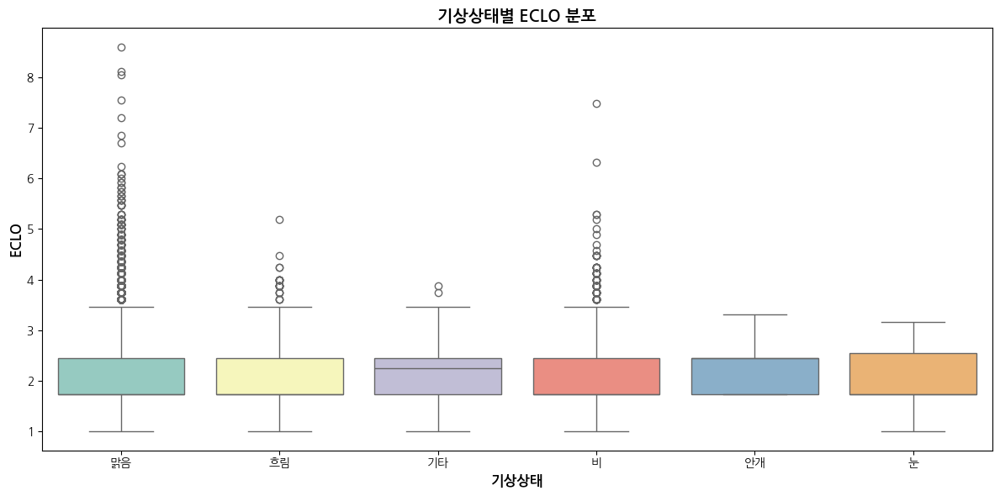
    </td>
    <td align="center" width="50%">
      노면상태에 따른 ECLO 평균 및 사고 건수<br>
      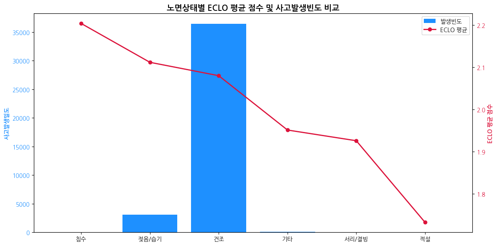
    </td>
  </tr>
  <tr>
    <td align="center" width="50%">
      도로형태1별 ECLO 평균 및 사고 건수<br>
      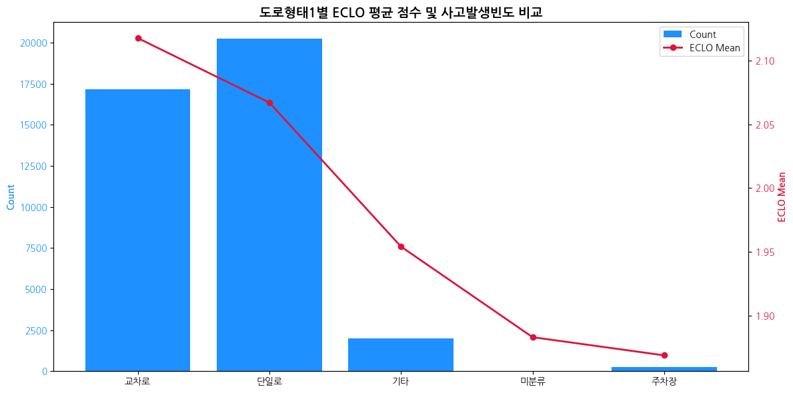
    </td>
    <td align="center" width="50%">
      도로형태2별 ECLO 평균 및 사고 건수<br>
      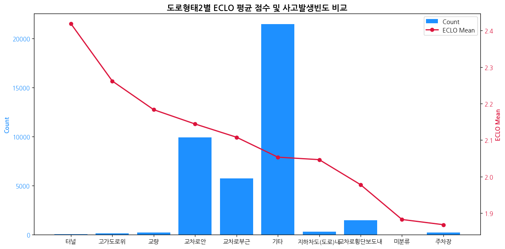
    </td>
  </tr>
</table>

</div>

[환경적 요인 EDA 코드 바로가기](./6.%20현황분석/3.%20환경적%20정보에%20대한%20데이터%20현황%20분석.ipynb)

----------------------------------------------

### 📝 훈련 전용 피처
<div align="center">

<table>
  <tr>
    <td align="center" width="50%">
      피해운전자 성별에 따른 ECLO 평균과 사고 건수<br>
      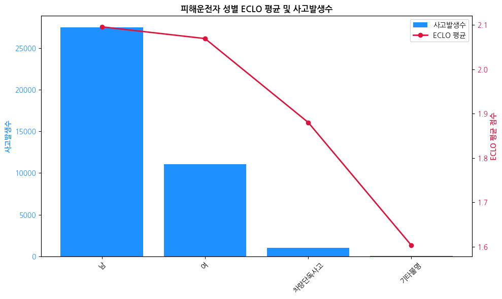
    </td>
    <td align="center" width="50%">
      가해운전자 연령대별 ECLO 평균<br>
      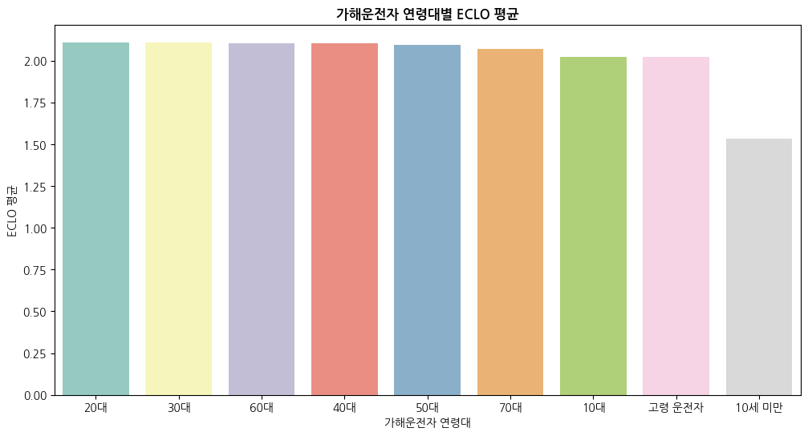
    </td>
  </tr>
  <tr>
    <td align="center" width="50%">
      법규위반 유형별 ECLO 평균 및 사고 건수<br>
      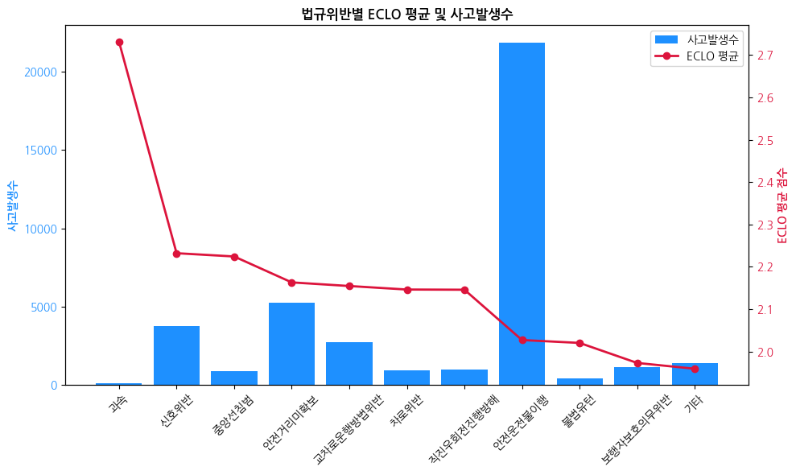
    </td>
    <td align="center" width="50%">
      사고유형-세부분류별 ECLO 평균 및 사고 건수<br>
      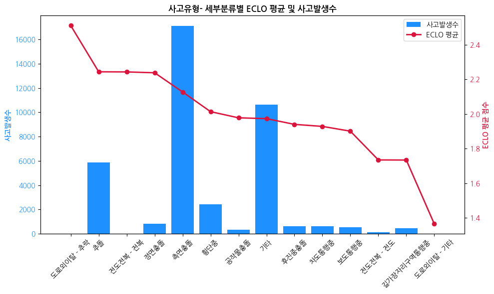
    </td>
  </tr>
</table>

</div>

[훈련 전용 피처 EDA 코드 바로가기](./6.%20현황분석/4.%20훈련데이터에만%20존재하는%20피처에%20대한%20현황분석.ipynb)

----------------------------------------------

## ⚙️ Feature Engineering
EDA 분석 결과를 바탕으로 사고 요인별 통계적으로 유의미한 변수에 대해 다양한 변환 방식과 파생변수 생성을 적용하고, 이를 조합해 모델의 일반화 성능을 검증했습니다. 각 조합별로 **Epochs=200**, **Patience=20** 설정으로 **10회** 반복 학습을 수행한 뒤 성능을 비교하여, 최종 모델 구조 구축에 활용할 **최적의 피처 조합**을 도출했습니다.

#### 1. 연도 변환 방법에 따른 성능 분석     
연도 값의 크기로 인해 모델 초기 가중치가 불안정하게 형성되는 현상이 관찰되어 연도에 `Log`, `Min-Max`, `Z-Score`스케일링 변환을 수행한 후, 변환 방법별 일반화 성능을 비교했습니다. 추가로 변환 과정에서 과적합 현상이 발견되어 `학습률 감소`, `Dropout 추가`, `L2 정규화 추가` 방법을 활용해 과적합 문제를 해결하고 모델 성능을 개선했습니다. 

실험 결과, `Log 변환 + L2 정규화(λ=0.001)` 적용 모델이 가장 우수한 성능을 보여 이를 기본 변환 방법으로 채택했습니다.

- **연도 Log 변환에 따른 모델 초기 가중치 변화**
  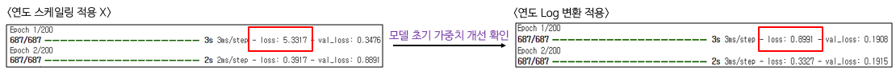

- **L2 정규화 추가에 따른 과적합 문제 해결**
  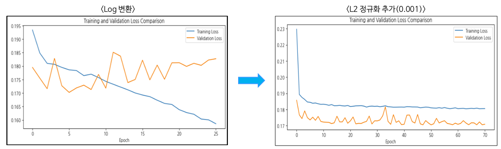

[연도 변환 방법에 따른 성능 분석 코드 바로가기](./7.%20피처%20엔지니어링/1.%20연도%20변환에%20따른%20모델%20성능%20분석/연도%20변환에%20따른%20모델%20성능%20분석.ipynb)

----------------------------------------------

#### 2. 시계열 변수 Sin/Cos 변환 및 관련 파생변수 추가에 따른 성능 분석   
각 시계열 변수(연·월·일·시간·요일)에 대해 조합별 **사이클릭 변환(Sin/Cos)**을 적용하여 최적의 변환 조합을 탐색했습니다. 이어서 EDA에서 유의미하게 나타난 시간대 및 요일 특성을 강화하기 위해 `주말 구분`, `시간대 구분`, `공휴일 구분`, `특성 교차(주말+공휴일)`와 같은 파생변수를 생성하고, 조합별 일반화 성능을 비교했습니다.

실험 결과, `월·일·시간` **Sin/Cos 변환** + `시간대 구분` + `특성 교차(주말+주중+공휴일)` 조합을 적용한 모델이 가장 우수한 성능을 보여, 이를 최적 조합으로 채택했습니다.

- **조합별 성능 점수 비교 결과**
  <div align="center">

  <table>
    <tr>
      <td align="center" width="50%">
        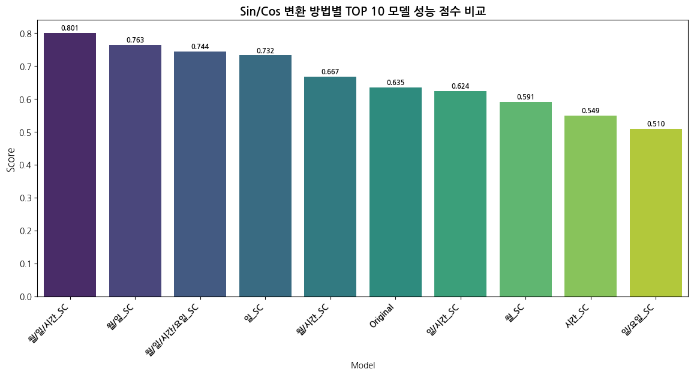
      </td>
      <td align="center" width="50%">
        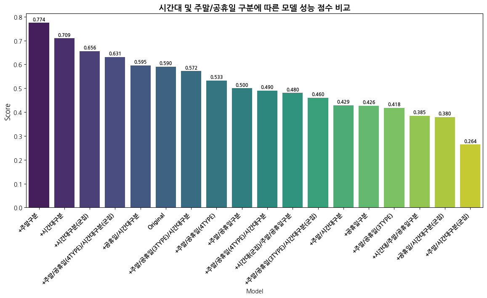
      </td>
    </tr>
  </table>

  </div>

[Sin/Cos 변환 방법에 따른 성능 분석 코드 바로가기](./7.%20피처%20엔지니어링/2.%20시계열%20변수%20변환에%20따른%20모델%20성능%20분석/Sin_Cos%20변환에%20따른%20모델%20성능%20분석.ipynb)    
[시간대구분, 주말/주중/공휴일 파생변수 조합에 따른 성능 분석 코드 바로가기](./7.%20피처%20엔지니어링/3.%20시계열%20변수에%20대한%20파생변수%20추가에%20따른%20모델%20성능%20분석/시계열%20변수에%20대한%20파생변수%20추가에%20따른%20모델%20성능%20분석.ipynb)

----------------------------------------------

#### 3. 공간적 정보 파생변수 추가에 따른 성능 분석
EDA에서 ECLO에 유의미한 영향을 미쳤던 `구별 면적`, `구별 면적 대비 보안등/CCTV 설치 밀도`, `동 위험도 군집` 파생변수에 대한 일반화 성능 비교 분석을 통해 최적 조합을 탐색했습니다.

실험 결과, `구별 면적`과 `구별 CCTV 설치밀도`에 Z-Score 표준화를 진행하고 `동 위험도 구분 군집` 파생변수를 추가한 모델이 가장 우수한 성능을 보여 이를 최적 조합으로 채택했습니다.

- **파생변수 생성 형태**
  <div align="center">

    <table>
      <tr>
        <td align="center" width="50%">
          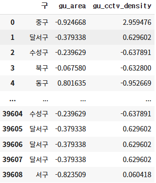
        </td>
        <td align="center" width="50%">
          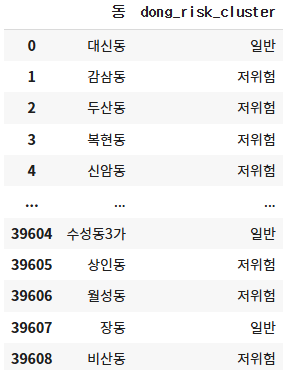
        </td>
      </tr>
    </table>

  </div>
  
  - `동별 위험도 구분` 은 군집별 ECLO 기반 통계량을 기준으로 설정했습니다.

[구별 면적 및 CCTV/보안등 추가에 따른 성능 분석 코드 바로가기](./7.%20피처%20엔지니어링/4.%20구별%20면적%20및%20CCTV_보안등%20설치%20밀도에%20따른%20모델%20성능%20분석/구별%20면적%20및%20CCTV_보안등%20설치%20밀도에%20따른%20모델%20성능%20분석.ipynb)   
[동 위험도 구분에 따른 성능 분석 코드 바로가기](./7.%20피처%20엔지니어링/5.%20동별%20위험도%20구분에%20따른%20모델%20성능%20분석/동별%20위험도%20구분에%20따른%20모델%20성능%20분석.ipynb)

----------------------------------------------

#### 4. 환경적 정보 변수 제거 및 범주 결합, 파생변수 추가에 따른 성능 분석
EDA 결과를 기반으로 통계적으로 유의하지 않은 변수에 대한 제거 및 상대적으로 사고 발생 건수가 작은 범주에 대한 범주 결합, 범주 수가 많고 유의한 변수 대상으로 다변량 군집분석을 통한 위험도 구분 등의 조합에 대한 일반화 성능 비교를 통해 모델 성능을 개선했습니다. 

- **기상상태** 
  - 범주 결합: `안개` + `비` → `안개/비` / `눈` + `흐림` → `눈/흐림`으로 결합
  - 변수 제거: `기상상태`는 회귀분석 결과 ECLO 통계적으로 유의하지 않은 변수로 나타나 변수 제거 후 일반화 성능 비교 

- **노면상태**
  - 범주 결합: `침수` + `젖음/습기` → `습기계` / `적설` + `서리/결빙` → `결빙계`로 통합

- **도로형태1**
  - 범주 결합: `미분류` + `주차장` → `비일반도로`로 통합
  
- **도로형태2**
  - 다변량 군집분석 활용 `도로형태2별 위험도 구분` 파생변수 생성 

**조합 방식별 일반화 성능 비교 결과(요약)**
| Model | Description                       | MSE      | RMSE     | RMSLE    | R²       | Score   |
|-------|-----------------------------------|----------|----------|----------|----------|---------|
| 0     | +도로형태1_범주결합(기상상태포함) | 9.231661 | 3.038357 | 0.426007 | 0.009999 | 0.785184 |
| 1     | +기상(결합)/도로형태2(결합, 군집) | 9.247120 | 3.040902 | 0.425839 | 0.008341 | 0.774935 |
| 2     | +기상상태제거/도로형태2(군집)     | 9.262912 | 3.043494 | 0.425805 | 0.006647 | 0.678695 |
| ...   | ...             | ...      | ...      | ...      | ...      | ...     |
| 7     | +도로형태2(결합)_도로형태2(군집)  | 9.245784 | 3.040681 | 0.426146 | 0.008484 | 0.593839 |
| 8     | +기상상태_범주결합                | 9.240130 | 3.039749 | 0.426239 | 0.009090 | 0.578230 |
| 9     | +도로형태1/2(결합)                | 9.270282 | 3.044705 | 0.425958 | 0.005857 | 0.529643 |
| 10    | Original(기존모델)                          | 9.271972 | 3.044983 | 0.425970 | 0.005676 | 0.509505 |

성능 측정 결과, `기상상태` 변수를 제거하지 않고 도로형태1의 `미분류`와 `주차장` 범주를 결합시킨 모델이 가장 우수한 성능을 보여 이를 최적 조합으로 채택했습니다.

[환경적 변수 변환에 따른 성능 분석 코드 바로가기](./7.%20피처%20엔지니어링/6.%20환경적%20변수%20변환에%20따른%20모델%20성능%20분석/환경적%20변수%20변환에%20따른%20모델%20성능%20분석.ipynb)

----------------------------------------------

#### 5. 훈련 전용 피처 기반 파생변수 추가에 따른 성능 분석
훈련 데이터에만 존재하는 피처는 테스트 데이터에서 사용할 수 없기 때문에 그대로 활용하기 어렵습니다. 따라서, 해당 피처 내 고위험 범주가 발생할 확률을 기반으로 한 파생변수 생성 방식을 적용했습니다.

- **확률 기반 고위험 범주 파생변수 생성 절차**
  1. **기준 변수 선정**: 훈련·테스트 데이터 모두에 존재하는 공통 변수를 ECLO에 대해 타겟 인코딩하고, 훈련 전용 피처를 종속변수로 설정하여 **설명력이 가장 높은 변수를 기준 변수**로 채택

  2. **고위험 범주 정의**: ECLO 통계량 기반 군집 분석을 수행해 **고위험 ECLO 군집을 식별**하고, 해당 군집에 속하는 비율이 높은 범주를 `고위험 범주`로 정의

  3. **확률 계산**: 각 훈련 전용 피처별로 연관성 높은 기준 변수와 결합하여, `고위험 범주`가 **발생할 확률을 산출**
  
  4. **파생변수 생성 및 검증**: 산출된 확률을 새로운 파생변수로 추가하고, **조합별 일반화 성능을 비교하여 최적 피처 조합을 탐색**

<div align="center">
  <table>
    <tr>
      <td align="center" width="50%">
        ECLO 군집별 분포 및 고위험 군집 설정<br>
        
      </td>
      <td align="center" width="50%">
        고위험 법규위반 범주 선정 예시<br>
        
      </td>
    </tr>
  </table>
</div>

- `과속`과 `중앙선침범` 범주가 `High_Risk_Cluster` 범주에 포함된 비율이 높음으로 해당 범주를 법규위반에 대한 **고위험 사고 유발 범주**로 정의

조합별 성능 측정 결과, `도로형태1 기반 고위험 사고유형-세부분류 발생확률(Min-Max)` + `도로형태2 기반 고위험 피해운전자 성별 발생확률(Min-Max)` 조합이 가장 우수한 일반화 성능을 보였습니다.

[훈련 전용 피처 변환에 따른 성능 분석 코드 바로가기](./7.%20피처%20엔지니어링/7.%20훈련데이터에만%20존재하는%20피처%20통계적%20파생변수%20추가에%20따른%20모델%20성능%20분석/)

----------------------------------------------

#### 피처 엔지니어링 결과
피처 엔지니어링 결과, 선정된 최종 최적 피처 조합은 다음과 같습니다.

- **피처 변환**
  - 연도 Log 변환 및 L2 정규화 추가
  - 월·일·시간 Sin/Cos 변환
  - 종속변수(ECLO) 제곱근 변환
  - `도로형태1` 범주 병합

- **파생변수 생성**
  - `시간대구분` 추가
  - `주말/주중/공휴일` 특성교차 파생변수 추가
  - `구별 면적 / CCTV 설치 밀도` 추가
  - `동별 위험도 구분 군집` 추가
  - `고위험 사고유형-세부분류 및 피해운전자 성별 발생확률` 추가

해당 피처 조합을 최종 조합으로 결정한 후, 모델 엔지니어링을 수행했습니다.

----------------------------------------------

## 🤖 Model Engineering
피처 엔지니어링 과정을 통해 최종 결정된 최적 피처 조합을 기반으로 Optuna 기반 하이퍼파라미터 최적화(HPO) 기법을 사용해 모델 구조 최적화를 수행했습니다.

- **목표** : RMSLE 최소화(`direction='minimize'`)
- **탐색 횟수** : 80번(`n_trials=80`)

- **탐색 공간 설정**
  | 하이퍼파라미터 | 탐색 범위 / 값 | 설명 |
  |----------------|----------------|------|
  | **n_layers** | `Int[3, 7]` | 은닉 레이어 개수 |
  | **initial_units** | `Categorical[unit_val]` *(예: [64, 128, 256, 512])* | 첫 번째 레이어 유닛 수 |
  | **learning_rate** | `Float[1e-4, 1e-2] (log)` | 학습률 |
  | **min_units** | `Categorical[16, 32]` | 레이어 축소 시 최소 유닛 수 |
  | **batch_size** | `Categorical[32, 64, 128]` | 배치 크기 |
  | **activation** | `Categorical['relu', 'softplus', 'elu']` | 활성화 함수 |
  | **loss** | `Categorical['mse', 'mae', 'rmse', 'rmsle', 'huber']` | 손실 함수 (공식 지표 RMSLE 포함) |
  | **optimizer** | `Categorical['adam', 'rmsprop', 'nadam']` | 최적화 알고리즘 |
  | **use_l2** | `Categorical[True, False]` | L2 정규화 적용 여부 |
  | **l2_lambda** | `Float[1e-3, 1e-1] (log)` *(if use_l2=True else 0)* | L2 정규화 계수 |

- **데이터 & 평가 프로토콜**
  - 데이터 분할: Train(2019~2020) / Val(Train의 20%) / Test(2021)
  - 평가 지표: RMSLE
  - Epochs: 200 / Early Stopping: patience = 20 / restore_best_weights=True
  - 인코딩 : 범주형 변수에 대해 훈련데이터 기반 원-핫 인코딩 사용

- **모델 구조**
  

- **HPO 결과 요약**
  | Trial_Num | Layers                     | Activation | Optimizer | Loss_Func | Batch_Size |      LR   | L2_Lambda |    MSE    |  RMSE   | RMSLE   |    R2    |
  |----------:|----------------------------|:----------:|:---------:|:---------:|-----------:|----------:|----------:|----------:|--------:|--------:|---------:|
  |        17 | [256, 128, 64, 32]         | relu       | adam      | rmsle     |         64 | 0.000204  | 0.001043  | 9.371663  | 3.061317| 0.424579| -0.005015|
  |        47 | [128, 64, 32, 16]          | relu       | adam      | rmsle     |        128 | 0.001195  | 0.001886  | 9.338837  | 3.055951| 0.424925| -0.001495|
  |        46 | [128, 64, 32, 16]          | relu       | adam      | rmsle     |         64 | 0.000281  | 0.001872  | 9.371971  | 3.061368| 0.425000| -0.005048|
  |        41 | [128, 64, 32, 16]          | elu        | adam      | rmsle     |         64 | 0.000367  | 0.003674  | 9.353382  | 3.058330| 0.425007| -0.003055|
  |        38 | [128, 64, 32, 16]          | elu        | adam      | rmsle     |         64 | 0.000536  | 0.007229  | 9.362782  | 3.059866| 0.425019| -0.004063|
  |        …  | …                          | …          | …         | …         |         …  | …         | …         | …         | …       | …       | …        |

- **상위 5개 모델 성능 개선율**
  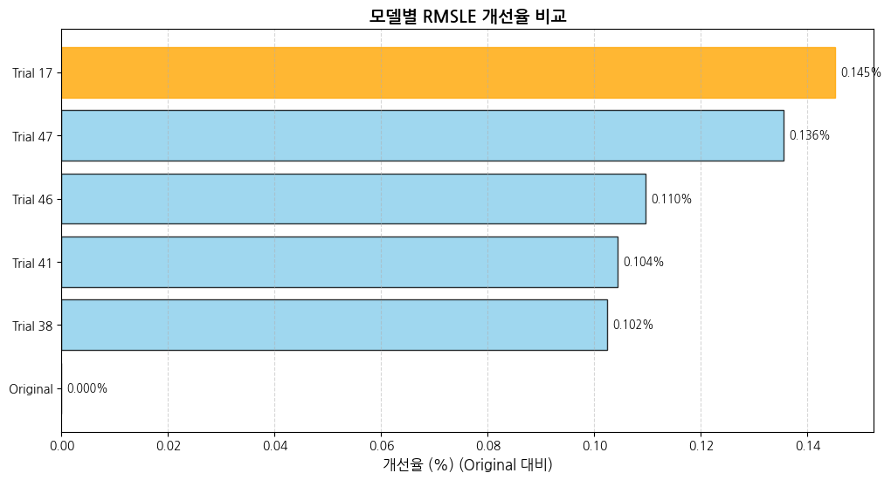

- **최종 모델 선정**
  - HPO 및 상위 모델 일반화 성능 측정 결과, 가장 우수한 RMSLE 성능을 보인 **Trial 17** 모델을 최종 모델로 선정
  - 해당 모델은 기존 모델(Original) 대비 RMSLE 기준 0.145%의 성능 개선율을 달성했으며, 값 스케일상 높은 성능 개선율을 보임

----------------------------------------------

## 최종 모델 제출 결과
DACON에 제출할 모델에 대해선 전체 데이터를 대상으로 학습해야하기 때문에, 학습 이전에 훈련 데이터의 10%를 검증 데이터로 설정하고 Epoch: 300 / Patience: 30 기준 Best Epoch를 탐색했습니다. 이후 전체 훈련 데이터를 대상으로 Best Epoch 기준으로 학습을 수행해 예측값을 도출했습니다.

위와 같은 방식으로 Baseline Model(기본전처리 + 단순 모델), Feature Engineering Model(피처 변환 및 파생변수 생성 + 과적합 완화 모델), Final Model(HPO 후 최종 최적 모델)에 제출을 통해 공식 RMSLE을 기반으로 최종 모델의 성능 개선 영향을 평가했습니다.

- **평가 모델별 공식 RMSLE 성능**
  


----------------------------------------------

## 📊 결과 요약
- **성능 최적화**
  - ANN 기반 최적 피처 조합을 활용한 HPO 수행 결과, RMSLE 기준 0.4367 → 0.4274 (약 2.13%)의 성능을 향상시켰습니다.
  - 확률 기반 파생변수와 시·공간 변수 영향력 강화를 시킨 피처 엔지니어링 부분에서 가장 큰 성능 개선 효과를 보였습니다.
  - 이는 모델 구조보다 ECLO 예측에 유의미한 방향으로 피처 변환 수행 방법이 성능 향상에 가장 유효한 방법임을 알 수 있습니다

-----------------------------------------------

## 🚀 향후 개선 방향 및 아쉬웠던 점
- 더 정교한 공간 데이터(도로 혼잡도, 교통량, 동 면적, 위험 구간 데이터)를 구할 수 없었던 점이 아쉬움
- 노트북으로 수행해야했기에 다양한 성능 측정(학습횟수 증가 등) 방법의 한계가 존재
- 시계열 딥러닝 모델(LSTM, Temporal Fusion Transformer 등)의 추가적인 모델 실험을 못해서 아쉬움 ``