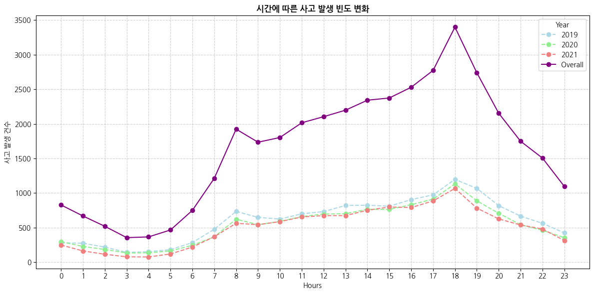

# 🚗 대구시 교통사고 데이터를 활용한 피해 분석 및 예측 모델 개발

## 📌 프로젝트 개요
**DACON**에서 진행한 **대구 교통사고 피해 예측 AI 경진대회**에 참가해 교통사고 데이터를 활용한 **사고 위험도(ECLO) 예측 모델**을 개발하는 프로젝트를 진행했습니다. 데이터 분석을 통해 현황 및 EDA 분석을 통한 주요 사고 위험 요인 인사이트를 탐색하고 탐색된 인사이트를 활용해 인공신경망(ANN) 기반 ECLO 점수를 예측하는 모델을 구축했습니다.

 본 프로젝트는 멀티캠퍼스 **데이터분석&엔지니어 교육 과정**에서 세미프로젝트로 처음 진행했으나, 당시 결과물이 만족스럽지 않아 교육 수료 이후 **개인 프로젝트로 전반적인 내용을 새롭게 재구성**하였습니다. 

### 🎯 프로젝트 목표
- DACON 제공 교통사고 데이터 및 외부데이터를 활용해 **사고 위험도(ECLO) 예측 모델 개발**
- **ECLO (Equivalent Casualty Loss Only)란 ?** : 인명피해 심각도를 나타내는 지표
    - **ECLO = 사망자수×10 + 중상자수×5 + 경상자수×3 + 부상자수×1**
- 모델 성능 평가 기준 : **RMSLE** 
- 통계 및 시각화 분석을 통한 주요 사고 위험 요인 탐색 후 탐색된 인사이트 활용 피처 엔지니어링 및 모델 엔지니어링을 통해 **주요 사고 위험 요인을 규명하고 최적 예측 모델을 구축**

### 📅 프로젝트 수행 기간
- **데이터분석&엔지니어 교육 과정 세미프로젝트** 
  - 팀 구성 : 4명
  - 기간 : 2023.11.14 ~ 2023.12.04  

- **개인 프로젝트로 리빌딩**
  - 팀 구성 : 1명
  - 기간 : 2025.05.01 ~ 2025.07.24

### 🔄 프로젝트 수행 방식
**데이터 수집 및 기본 전처리** → **데이터 셔플링 여부 결정 및 기본 분석 모델 선정** → **Layer·LR 최적화 실험** → **최적 인코딩 및 손실함수 선정** → **종속변수 변환 방법 선정** → **EDA** → **피처 엔지니어링** → **모델 엔지니어링** → **최종 모델 제출**

### 📊 수집 데이터 구성
| 구분 | 데이터 | 기간 | 규모 | 출처 |
|------|---------|------|------|------|
| **DACON 제공 데이터** | Train 데이터 (대구시 교통사고) | 2019~2021 | 약 4만 건 | DACON |
|  | Test 데이터 (대구시 교통사고) | 2022 | 약 1.1만 건 | DACON |
|  | 전국 교통사고 데이터 | 2019~2021 | 약 11만 건 | DACON |
| **외부 데이터** | 대구시 보안등 설치 위치 | - | - | D-데이터허브 |
|  | 대구시 CCTV 설치 위치 | - | - | D-데이터허브 |
|  | 대구시 연령별 인구 현황 | 2019~2021 | - | 대구통계 |
|  | 대구시 강수량 데이터 | 2019~2021 | - | 기상청 |
|  | 연도별 공휴일 정보 | - | - | 공공데이터포털 |

**훈련 데이터 피처 구성 목록**     
: `사고일시`, `시 군 구`, `기상상태`, `노면상태`, `도로형태`, `사고유형`, `사고유형-세부분류`, `법규위반`, `가해운전자 차종`, `가해운전자 성별`, `가해운전자 연령`, `가해운전자 상해정도`, `피해운전자 차종`, `피해운전자 성별`, `피해운전자 연령`, `피해운전자 상해정도`, `사망자수`, `중상자수`, `경상자수`, `부상자수`, `ECLO`

**테스트 데이터 피처 구성 목록**     
: `사고일시`, `시 군 구`, `기상상태`, `노면상태`, `도로형태`, `사고유형`

### 🔮 모델 학습 및 예측 프로세스


## ⚙️ 개발 환경
| 구분 | 기술 스택 |
|------|-----------|
|**언어·라이브러리** | Python, Pandas, NumPy, Scikit-learn, SciPy, Matplotlib, Seaborn |
|**딥러닝 프레임워크** | TensorFlow, Keras |
|**하이퍼파라미터 최적화** | Optuna |
|**개발 도구 및 환경** | Jupyter Notebook, Google Colab, Google Drive |

## 🔧 데이터 기본 전처리
원천 데이터 구조를 정리하고 분석 가능한 형태로 가공하기 위해 `정규표현식`을 사용해 다음과 같은 전처리를 수행했습니다.

- **사고일시 파싱** : `사고일시` → `연/월/일/시간` 단위로 분리

- **행정구역 분리** : `시군구` → `도시 / 구 / 동` 단위로 분리

- **도로형태 분리** : `단일로 - 기타`처럼 복합적으로 표기된 값을 분리해 `도로형태1`, `도로형태2`와 같은 파생변수 생성

[기본 전처리 코드 바로가기](./feature_basic_preprocessing.ipynb)

### 피처 특성 분류
훈련 데이터와 테스트 데이터의 피처 목록이 동일하지 않기 때문에 훈련 데이터 기준으로 변수를 시간적 요인·공간적 요인·환경적 요인·훈련 전용 피처로 특성을 분류했습니다.

1. 시간적 요인 : `연`, `월`, `일`, `시간`
2. 공간적 요인 : `구`, `동`
3. 훈련 전용 피처 : `가해운전자 차종/성별/연령`, `피해운전자 차종/성별/연령`, `법규위반`    
   (ECLO 점수 형성에 직접적인 영향을 주는 `사망자수`, `중상자수`, `운전자 상해정도`와 같은 피처는 분석에서 제외함)

## 🎴 데이터 셔플링 여부 결정 및 기본 분석 모델 선정
XGBoost, LightGBM, ANN 모델의 기본 구조를 활용해 데이터가 시계열적 특성을 갖고 있는지 확인하기 위해 데이터 분리 시, 각 모델별 `shuffle=False/True` 옵션을 적용해 단일 성능 측정을 비교했습니다.

단일 `RMSLE` 지표에 국한되지 않고 모델의 종합적 성능 비교를 위해 `MSE`, `RMSE`, `RMSLE`, `R²`를 함께 측정했습니다. 또한, 모델 간 공평한 성능 평가를 위해 각 지표를 정규화한 뒤 가중치를 적용한 `scoring_model` 함수를 설계했으며, 이때 가중치는 각각 **MSE(0.2)**, **RMSE(0.2)**, **RMSLE(0.5)**, **R²(0.1)** 로 설정했습니다.

- 모델 성능 점수 계산 함수
  ```
  def scoring_model(results):
    # 가중치 설정
    weights = {'MSE': 0.2, 'RMSE': 0.2, 'RMSLE': 0.5, 'R2': 0.1}

    # 정규화 함수
    # 평가지표 별 값의 범위를 통일하기 위해 Min-Max 스케일링 수행
    def min_max_normalize(series, is_better_lower=True):
      min_val = series.min()
      max_val = series.max()
      normalized = (series - min_val) / (max_val - min_val)

      # R2는 높을수록, MSE, RMSE, RMSLE는 낮을수록 성능이 좋은 특성을 반영
      if is_better_lower:
        return 1 - normalized
      else:
        return normalized

    # 정규화 적용
    df_normalized = results.copy()
    df_normalized['MSE'] = min_max_normalize(results['MSE'], is_better_lower=True)
    df_normalized['RMSE'] = min_max_normalize(results['RMSE'], is_better_lower=True)
    df_normalized['RMSLE'] = min_max_normalize(results['RMSLE'], is_better_lower=True)
    df_normalized['R2'] = min_max_normalize(results['R2'], is_better_lower=False)

    # 성능 종합 점수 계산
    # 평가지표별 Min-Max 스케일링 값 * 가중치
    df_normalized['Score'] = (df_normalized['MSE'] * weights['MSE'] +
                              df_normalized['RMSE'] * weights['RMSE'] +
                              df_normalized['RMSLE'] * weights['RMSLE'] +
                              df_normalized['R2'] * weights['R2'])


    results['Score'] = df_normalized['Score']

    # 점수에 따라 모델 정렬 (내림차순)
    results = results.sort_values(by='Score', ascending=False).reset_index(drop=True)

    return results  
  ```
데이터 셔플링 적용 여부에 따른 모델별 성능 점수 비교 결과 **셔플링을 적용하지 않은 인공신경망(ANN) 모델**이 가장 우수한 성능을 나타냈으며, 그에 따라 해당 모델을 **기본 분석 모델로 선정**했습니다. 또한, 이를 통해 해당 데이터가 **시계열적 특성**을 가진다는 점을 확인했습니다.

[코드 바로가기](./1.%20데이터%20셔플링%20여부가%20모델%20성능에%20미치는%20영향%20분석/1.%20데이터%20셔플링%20여부가%20모델%20성능에%20미치는%20영향%20분석.ipynb)

## 🔎 ANN Layer·LR 최적화

모델의 기본 구조만으로는 충분하지 않다고 판단하여, 최소한의 최적화를 통해 학습률(LR)과 층(Layer) 구성을 조정함으로써 모델의 기본 틀을 안정적으로 마련하고자 해당 실험을 진행하였습니다.
## 🔎 탐색적 데이터 분석(EDA)
교통사고 발생 위험 요인을 **시간적 요인(연·월·일·시간·요일)**, **공간적 요인(구·동, CCTV, 보안등 등)**, **환경적 요인(기상 상태, 도로 형태, 노면 상태 등)**, **훈련 전용 피처(운전자 연령/성별/차종, 법규 위반 등)** 로 구분하여 분석했습니다.

### ⏰ 시간적 요인 분석
[시간적 요인 현황 및 EDA 분석 코드 바로가기](./6.%20현황분석/1.%20시간적%20정보에%20대한%20데이터%20현황%20분석.ipynb)

#### 1. 시간별 ECLO 및 사고 발생 추이

<div align="center">

<table>
  <tr>
    <td align="center" width="50%">
      <b>시간별 ECLO 변화</b><br>
      
    </td>
    <td align="center" width="50%">
      <b>시간별 사고 발생 수 변화</b><br>
      
    </td>
  </tr>
</table>

</div>

- 전반적으로 **저녁부터 새벽 시간대(21시~05시)** 에 **사고 위험도(ECLO)가 높은 사고**가 집중되는 경향을 확인
- 반면, **사고 발생 건수는 낮 시간대(특히 출퇴근 시간대)에 집중**되어 ECLO 추세와는 상반된 패턴을 보였으며, **사고 건수와 ECLO 간 직접적인 상관성은 낮음**을 확인할 수 있다.
- 이는 **야간 음주운전, 졸음운전, 가시거리 부족 등 심야 특유의 위험 요인**으로 인해 사고 건수는 적더라도 **치명적 사고가 발생할 가능성이 높음을 시사**하며, 이에 따라 **심야 단속 강화, 가로등·CCTV 확충, 대중교통 연장 운영** 등 **야간 교통 안전 정책**의 필요성이 제기된다. 
- 또한, 연도별 시간대별 ECLO 추세가 유사하게 나타나는 점을 고려할 때, **시간대 구분 파생변수**를 추가하여 시간적 영향력을 더욱 정밀하게 반영할 수 있을 것으로 예상된다.

#### 2. 요일·주말·공휴일별 ECLO 및 사고 발생 추이

<div align="center">

<table>
  <tr>
    <td align="center" width="50%">
      <b>요일별 ECLO 및 사고 건수 변화</b><br>
      
    </td>
    <td align="center" width="50%">
      <b>주중/주말에 따른 ECLO 변화</b><br>
      
    </td>
  </tr>
</table>

</div>

- **요일별 ECLO 평균**은 금요일부터 점진적으로 상승하여 일요일에 최고치를 기록. 이는 사고 건수와 무관하게, **주말(특히 일요일)에 고위험 사고가 집중**되는 경향을 보여준다.
- **주중·주말 비교**에서도 주말의 ECLO 평균이 주중보다 높게 나타나, 전반적으로 **주말 사고의 심각도가 더 크다**는 점을 확인할 수 있다.
- 이러한 패턴을 모델에 반영하기 위해, **주중·주말 구분을 명시하는 파생 변수**를 추가하는 전략을 고려할 수 있음

<div align="center">

<table>
  <tr>
    <td align="center" width="50%">
      <b>공휴일에 따른 ECLO 변화</b><br>
      
    </td>
    <td align="center" width="50%">
      <b>주말 내 공휴일 여부에 따른 ECLO 변화</b><br>
      
    </td>
  </tr>
</table>

</div>

- **공휴일과 비공휴일 비교**: 공휴일의 평균 사고 위험도(ECLO)가 비공휴일보다 높게 나타나, **공휴일에 상대적으로 고위험 교통사고가 더 빈번하게 발생**하는 경향을 확인
- **주말 내 공휴일 여부 비교**: 박스플롯 분석 결과, 주말 내 비공휴일의 ECLO 분포에서 **고위험 사고를 나타내는 이상치가 더 자주 발생**했으며, 주말 내에서 공휴일의 여부는 **고위험 교통사고 발생에 뚜렷한 영향을 미치지 않는 요인**으로 나타남

### 🗺️ 공간적 요인 분석
[공간적 요인 현황 및 EDA 분석 코드 바로가기](./6.%20현황분석/2.%20공간적%20정보에%20대한%20데이터%20현황%20분석.ipynb)

<div align="center">

<table>
  <tr>
    <td align="center" width="50%">
      <b>구별 공간 기반 ECLO 분포</b><br>
      
    </td>
    <td align="center" width="50%">
      <b>구별 면적, ECLO 평균, 사고 건수 추세 비교</b><br>
      
    </td>
  </tr>
</table>

</div>

- 달성구, 동구와 같은 외곽 및 면적이 넓은 지역은 평균 ECLO가 높게 나타나는 경향을 보임. 이는 고속도로·터널 등 속도 제한이 높은 도로의 분포, 고속 주행 빈도, 그리고 응급 대응 지연 가능성이 복합적으로 작용해 고위험 사고로 이어질 가능성이 큼을 시사한다.
- 반대로 달서구, 수성구와 같은 도심·주거 혼합 지역은 사고 건수 자체는 많지만, 도심 특성상 고속 주행 빈도가 낮아 치명적 사고 위험이 줄어들며, 그 결과 평균 ECLO는 상대적으로 낮게 나타남을 보인다. 

<div align="center">

<table>
  <tr>
    <td align="center" width="50%">
      <b>구별 면적대비 보안등 설치 밀도와 ECLO 평균 비교</b><br>
      
    </td>
    <td align="center" width="50%">
      <b>구별 면적대비 CCTV 설치 밀도와 ECLO 평균 비교</b><br>
      
    </td>
  </tr>
</table>

</div>

- 보안등 및 CCTV 모두 설치 밀도가 낮은 지역(구) 일수록 ECLO 평균이 높게 나타나는 경향이 관찰됨. 추가적인 상관 및 ANOVA 분석 결과, 해당 변수는 ECLO에 통계적으로 유의미한 영향을 미치는것을 확인
- 따라서, 지역의 면적과 교통 환경 및 시설이 ECLO 형성에 중요한 영향을 미친다고 볼 수 있으며, 이에 대한 설명력을 강화하기 위해 구별 면적·보안등·CCTV 설치밀도에 대한 파생변수의 추가를 고려해볼 수 있다. 

#### 다변량 군집분석을 통한 동 위험도 구분
상대적으로 범주 수가 많은 동 데이터에 대해 `K-Means 클러스터링 기법`을 활용한 동별 ECLO 통계량 기반 **다변량 군집분석**을 수행해 동별 위험도 구분에 따른 ECLO에 미치는 영향을 분석했습니다. 

- 동별 ECLO 통계량 기반 Elbow Method 활용 최적 군집 수 K값 탐색 
  

- 최적 K값으로 K-Means 클러스터링 수행 후, PCA 시각화를 통한 군집별 특성 분석
  

- 다변량 군집분석을 통해 구분된 동별 군집에 대한 ANOVA 검정 결과, 군집 간 ECLO 점수는 통계적으로 매우 유의한 차이를 보임
- 따라서 동이 ECLO에 미치는 영향을 부각시키기 위해, 동별 군집 파생변수를 추가시키는 방법을 고려해볼 수 있다.

### 🌦️ 환경적 요인 분석
[환경적 요인 현황 및 EDA 분석 코드 바로가기](./6.%20현황분석/3.%20환경적%20정보에%20대한%20데이터%20현황%20분석.ipynb)

- 기상상태별 ECLO 분포
  

- 도로형태2별 ECLO 평균 및 사고 건수 비교
  
  
### 📝 훈련 전용 피처 분석
[훈련 전용 피처 현황 및 EDA 분석 코드 바로가기](./6.%20현황분석/4.%20훈련데이터에만%20존재하는%20피처에%20대한%20현황분석.ipynb)

<div align="center">

<table>
  <tr>
    <td align="center" width="50%">
      <b>피해운전자 성별에 따른 ECLO 평균과 사고 건수</b><br>
      
    </td>
    <td align="center" width="50%">
      <b>가해운전자 연령대별 ECLO 평균</b><br>
      
    </td>
  </tr>
  <tr>
    <td align="center" width="50%">
      <b>법규위반 유형별 ECLO 평균 및 사고 건수</b><br>
      
    </td>
    <td align="center" width="50%">
      <b>사고유형-세부분류별 ECLO 평균 및 사고 건수</b><br>
      
    </td>
  </tr>
</table>

</div>

### 피처 엔지니어링
EDA 분석 기반 통계적으로 유의미한 영향을 미치는 파생변수에 대해 반복성능 10회 기준 일반화 성능을 측정해 최종 피처 조합을 구축했습니다.

- 피처 엔지니어링 수행 방법
  - 시계열 변수
    - 연도 Log 변환
      - 과적합 완화 위해 L2 정규화(0.001) 적용 
    - 시계열 변수(월·일·시간·요일) Sin/Cos 변환
    - 시간대구분 추가
    - 주말 + 공휴일을 합친 특성교차 피처 추가 
  - 공간적 변수
    - 구별 면적 및 CCTV 설치 밀도 추가 (Z-Score 표준화 수행)
    - 동 위험도 군집 추가
  - 환경적 변수
    - 도로형태1 범주 결합 (미분류+주차장 → 비일반도로로 변환)